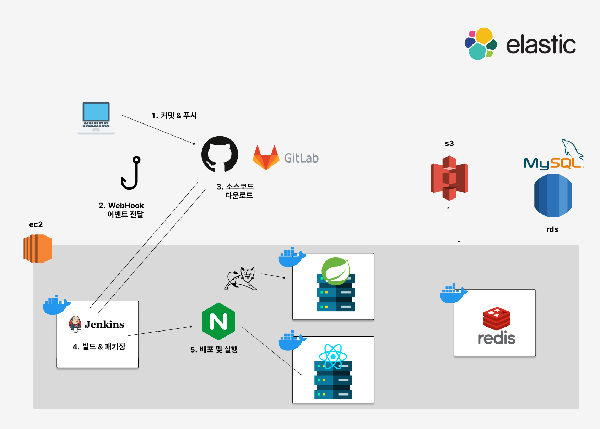

# 오늘의 학습 정리 (2025년 1월 16일, 목요일)

Jenkins 활용법 및 다시 봄(Re: Spring) 프로젝트의 System Architecture를 어떻게 구성하면 좋을지에 대한 학습을 진행하였습니다.

---

## 오늘 배운 것
### 1. **CI/CD 파이프라인 구성**
- CI/CD 파이프라인의 전반적인 흐름을 이해함.
- **주요 단계:**
  1. **커밋 & 푸시**: 로컬에서 작성한 코드를 원격 저장소(GitHub)에 푸시.
  2. **WebHook 이벤트 전달**: GitHub에서 코드 변경 이벤트를 Jenkins에 전달.
  3. **소스코드 다운로드**: Jenkins가 GitHub에서 최신 소스코드를 가져옴.
  4. **빌드 & 패키징**: Jenkins가 소스코드를 빌드하고 필요한 패키징 작업 수행.
  5. **배포 및 실행**: 빌드 결과물을 서버에 배포하고 실행.

---

### 2. **Nginx의 역할**
- Nginx는 **리버스 프록시**, **정적 파일 서빙**, **로드 밸런싱**, **보안** 등을 제공.
- 주요 사용 사례:
  - 클라이언트 요청을 Docker 컨테이너에 전달.
  - 정적 파일 서빙으로 애플리케이션 서버의 부하 감소.
  - SSL/TLS 설정을 통해 보안 강화.
  - 고성능 트래픽 처리를 위해 이벤트 기반 설계.

---

### 3. **Docker의 활용**
- Docker를 통해 컨테이너화된 애플리케이션 배포를 학습.
- Jenkins에서 빌드된 애플리케이션을 Docker 이미지로 생성하고 컨테이너 실행.
- **새로운 추가 단계:**
  1. Docker 이미지 생성 (`Dockerfile` 사용).
  2. 생성된 이미지를 Docker Hub 또는 내부 레지스트리에 푸시.
  3. Docker 컨테이너 실행 및 Nginx와 연결.

---

### 4. **Jenkins Pipeline 구성**
- Jenkins의 **Pipeline Script**를 작성하여 CI/CD 파이프라인 자동화.
- **주요 작업:**
  - GitHub에서 코드 체크아웃.
  - Maven을 사용하여 빌드 및 패키징.
  - SCP를 통해 원격 서버에 파일 전송.
  - 원격 서버에서 애플리케이션 실행 및 로그 확인.
- 다양한 상황(배포 실패, 성공)에 대응하는 `post` 단계 설정.

---

## 오늘 한 일
### 1. **Jenkins 설치**
- Docker를 활용하여 Jenkins를 컨테이너로 설치.
- 사용한 커맨드:
  ```bash
  sudo docker run -d -p 8080:8080 -p 50000:50000 --name jenkins --restart=always -v jenkins_home:/var/jenkins_home jenkins/jenkins:lts

### 2. 예시 Pipeline Script 작성
- Jenkins에서 Groovy 기반의 Pipeline Script를 작성하여 CI/CD 프로세스를 자동화합니다.
이 스크립트는 GitHub에서 코드를 가져와 Maven으로 빌드한 후 원격 서버에 배포합니다.
- 주요 스크립트:
   ```bash
   pipeline {
    agent any

    tools {
        maven "M3" // Jenkins에 설정된 Maven 이름
    }

    stages {
        stage('Checkout') {
            steps {
                git url: 'GIT URL', branch: 'main', credentialsId: 'github_token'
            }
        }
        stage('Build') {
            steps {
                script {
                    sh 'mvn clean package'
                }
            }
        }
        stage('Deploy') {
            steps {
                script {
                    def jarFile = 'target/xxx-0.0.1-SNAPSHOT.jar'
                    def serverIp = 'xxx.xxx.xxx.xxx'
                    def deployPath = '/root'
                    def runAppCommand = "nohup java -jar $deployPath/xxx-0.0.1-SNAPSHOT.jar > $deployPath/app.log 2>&1 &"
                    def checkLogCommand = "grep -q 'Started xxx in' $deployPath/app.log"
                    
                    // 기존 애플리케이션 종료
                    sshagent(['deploy_ssh_key']) {
                        sh script: "ssh root@$serverIp 'pgrep -f xxx-0.0.1-SNAPSHOT.jar && pkill -f xxx-0.0.1-SNAPSHOT.jar || echo \"No process found\"'", returnStatus: true
                    }
                    
                    // 서버에 파일 전송
                    sh "scp -o StrictHostKeyChecking=no $jarFile root@$serverIp:$deployPath/"
                    
                    // 원격 서버에서 애플리케이션 실행
                    sshagent(['deploy_ssh_key']) {
                        sh "ssh -o StrictHostKeyChecking=no root@$serverIp '$runAppCommand'"
                        sleep 20
                        int result = sh script: "ssh -o StrictHostKeyChecking=no root@$serverIp '$checkLogCommand'", returnStatus: true
                        if (result == 0) {
                            echo 'Deployment was successful.'
                        } else {
                            error 'Deployment failed.'
                        }
                    }
                }
            }
        }
    }

    post {
        success {
            echo 'Deployment completed successfully.'
        }
        failure {
            echo 'Deployment encountered an error.'
        }
    }
}

### 3. 직접 작성해 본 다시 봄(RE: Spring) 프로젝트의 System Architecture 예시


### 3. 개선 및 느낀 점
- Nginx와 Docker의 조합이 강력한 이유를 체감:
   - 컨테이너화된 애플리케이션의 유연성과 성능 최적화를 동시에 제공.

- Jenkins Pipeline 활용:
   - CI/CD를 자동화하며 반복 작업을 줄이고, 배포 신뢰성을 높일 수 있음을 확인.
- 추후 추가 학습 필요:
   - Docker Compose 및 Kubernetes를 활용한 다중 컨테이너 관리.
   - CI/CD 파이프라인의 테스트 자동화 및 모니터링 강화.